# Order Delivery Mobile Application

A production-ready Flutter application designed to manage delivery operations.
The app enables delivery agents (genies) to receive orders in real time, communicate with customers,
and manage the complete order lifecycle from order acceptance to delivery completion.

---

## Features
- User authentication (Login / Register / Logout)
- Real-time order notifications using Firebase Cloud Messaging
- Order acceptance and rejection workflow
- Multi-store order handling
- Order status updates throughout the delivery process
- Real-time chat between delivery agents (genies) and customers using WebSockets
- Customer rating and issue reporting
- Clean and user-friendly UI

---

## Tech Stack
- Flutter & Dart
- Provider (State Management)
- Node.js REST APIs
- MongoDB
- Firebase Cloud Messaging
- WebSockets (Real-time communication)
- Git & GitHub

---

## Real-time Communication

The application implements real-time chat functionality between delivery agents (genies) and customers
using WebSockets. A dedicated socket service is responsible for establishing and managing
the socket connection on the Flutter side.

The Flutter app listens to backend socket events and updates the UI in real time,
while the Node.js backend handles socket connections, message broadcasting,
and event management.

---

## Architecture

The application follows a layered architecture with a clear separation of concerns,
making the codebase maintainable, scalable, and easy to understand.

### Project Structure Overview

- **core**
  - Contains shared constants and shared styles used across the application.

- **data**
  - Holds data models representing API responses and domain entities.

- **presentation**
  - Contains all UI-related code including screens and reusable widgets.
  - Screens are organized by user roles (customer and genie) and application flows.

- **providers**
  - Manages application state using Provider for state management.
  - Handles business logic and coordinates between UI and data/services layers.

- **services**
  - Responsible for external interactions such as REST API calls, Firebase services,
    and socket communication.
  - Acts as a bridge between the application and backend systems.

- **utils**
  - Contains shared helper utilities including local storage.

### Architecture Principles
- Separation of UI, business logic, and data layers
- Modular and reusable components
- Scalable structure that can evolve into a feature-based architecture
- Clean and maintainable codebase

This architecture allows the application to support complex workflows such as real-time
order handling, notifications, and chat features while remaining easy to extend and maintain.

---

## Backend

The backend is implemented using Node.js and exposes RESTful APIs that handle:
- Authentication
- Order management
- Order status updates
- Delivery agent (genie) status updatee (online, offline)
- Messaging and chat functionality

MongoDB is used as the primary database, and WebSockets are used to support real-time
communication between users.

---

## Getting Started

1. Clone the repository: `git clone https://github.com/Ghofran-malket/order-delivery-app.git`
2. Run `flutter pub get`
3. Configure Firebase
4. Run `flutter run`

---

## Screenshots

### Entry Screens
| Splash | Welcome |
|------|---------------|
|  | 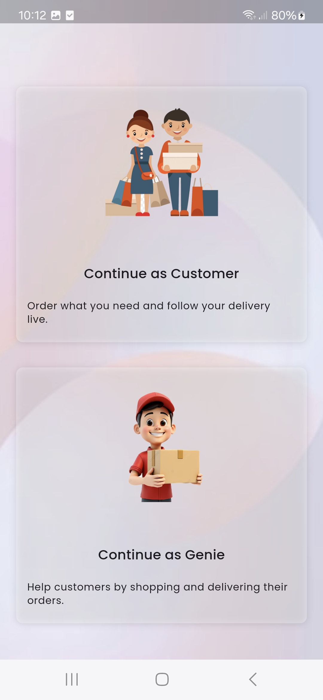 |

### Authentication
| Login | Register | Logout
|------|---------------|---------------|
| 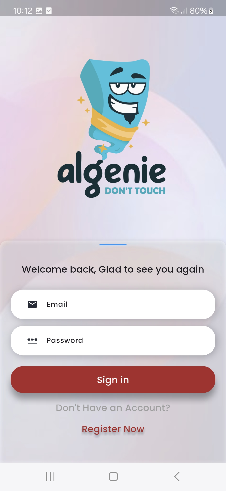 | 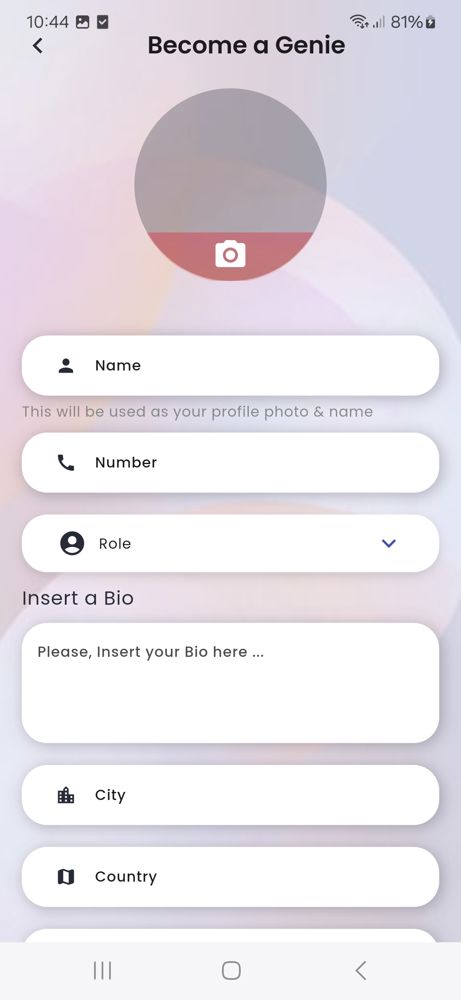 | 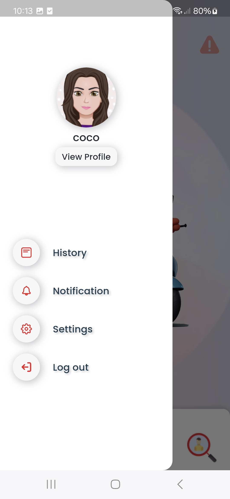 |

### Post-Login Flow
| Invite Friends |
|---------------|
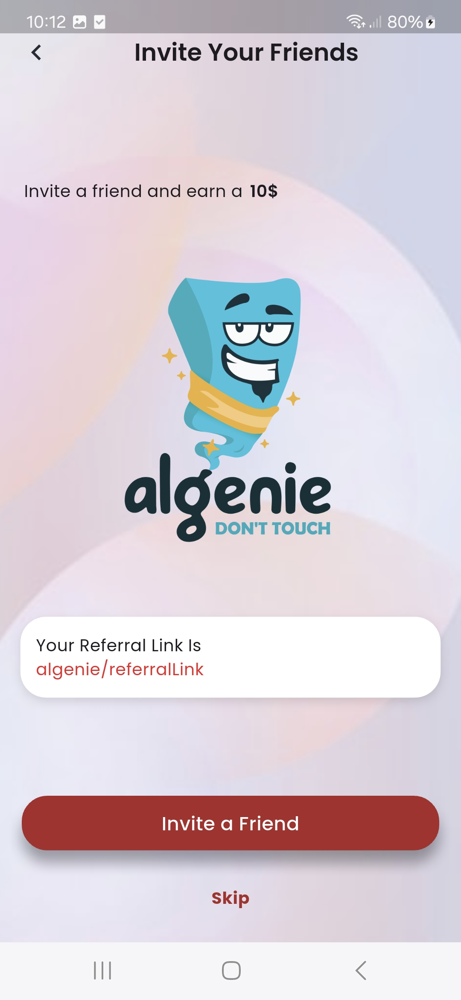

### Deliver Agent (genie) Flow
| Home (onffile genie) | Home (online genie) | Home (online genie 2) | 
|------|---------------|---------------|
| 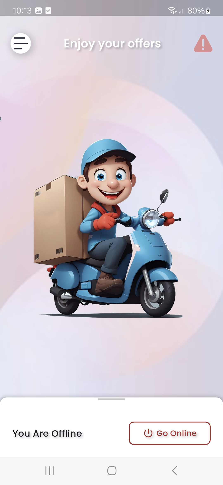 | 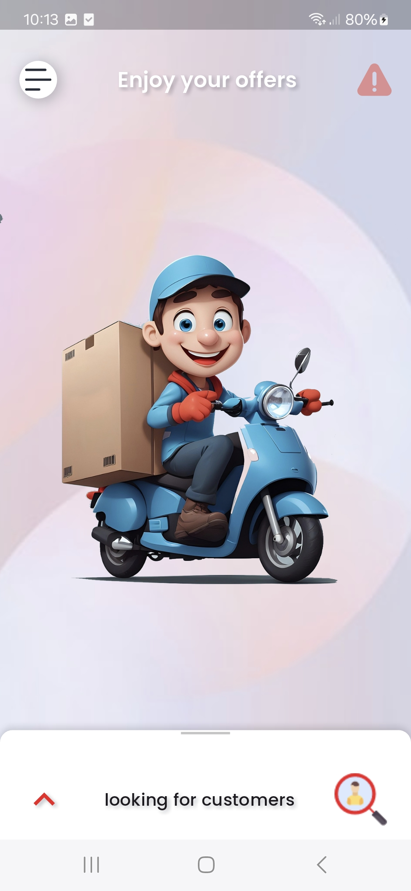 | 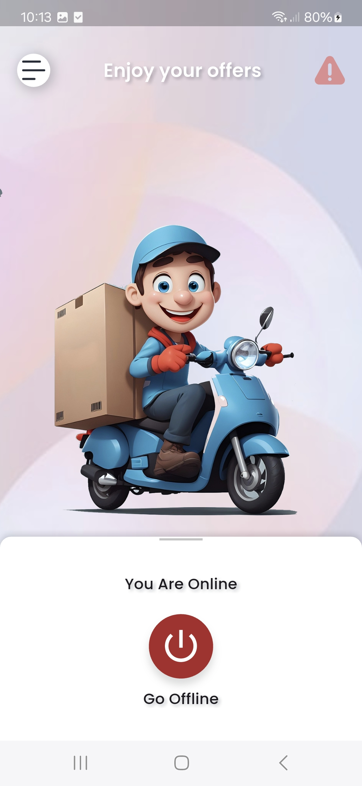 |

### Order Flow
| Notification | Home (with order) | Order Details with multiple store | 
|------|-------------------|------|
| 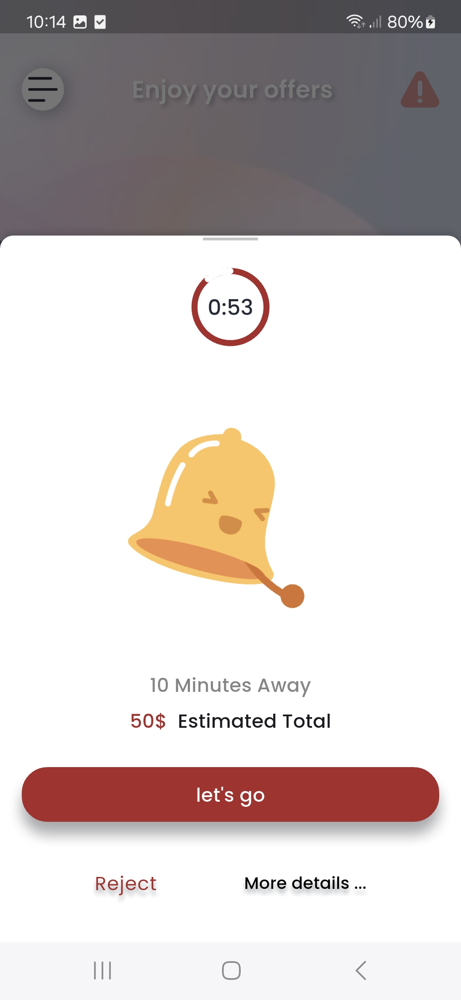 | 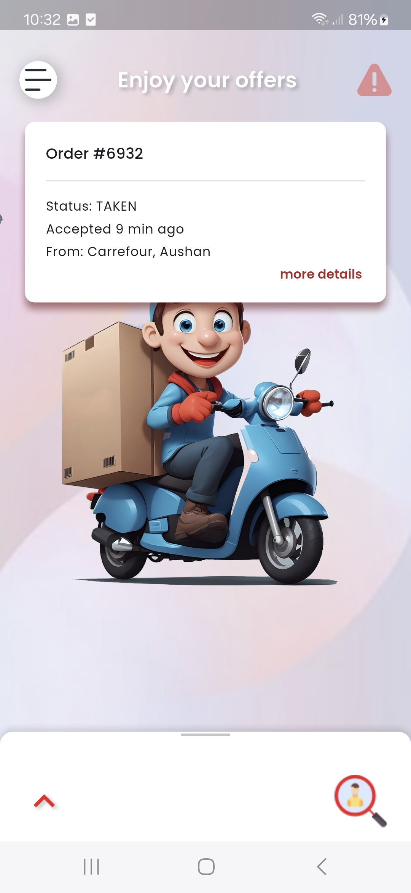 | 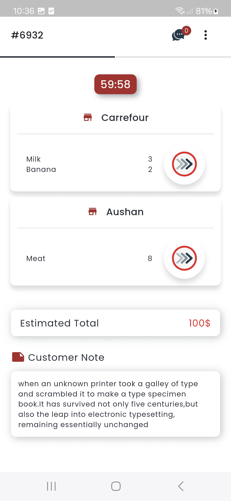  |

| Go To Store | Arrive To Store | Pick up Done |
|------|-------------------|------|
|  | 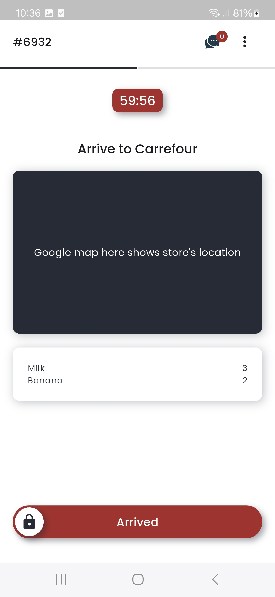 | 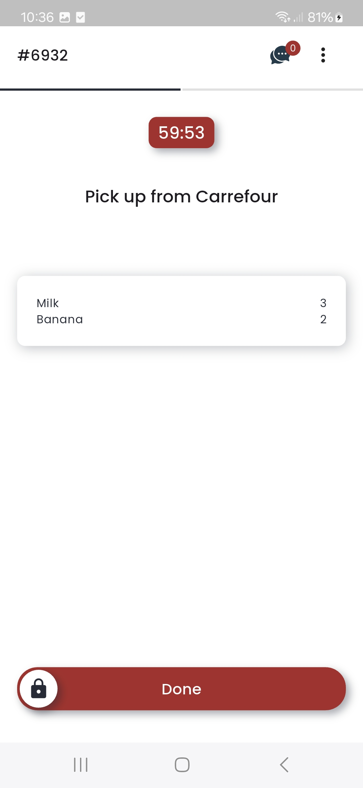 |

| Receipt Photo | Customer Location | Order Delivered |
|------|-------------------|------|
| 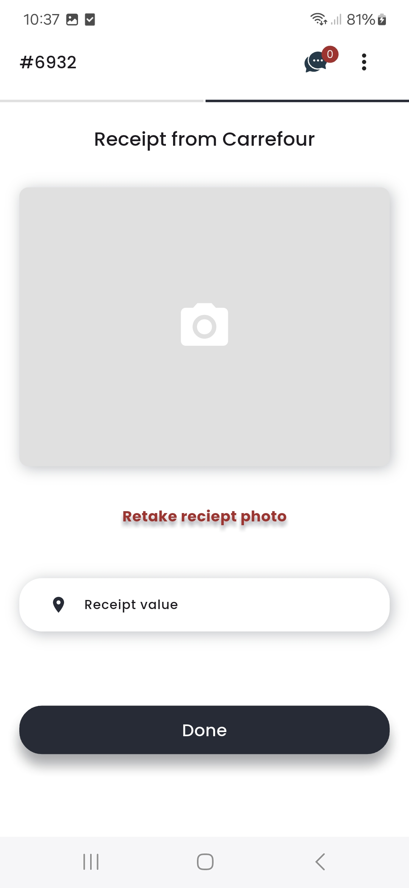 | 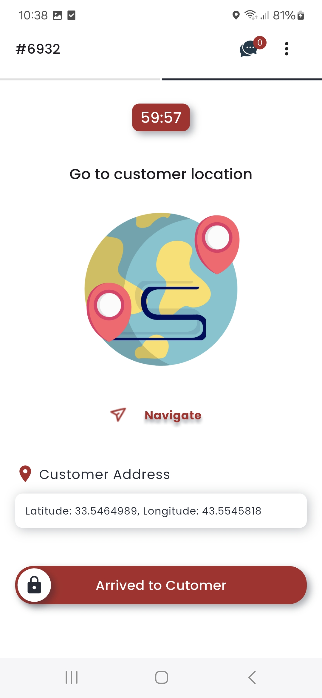 | 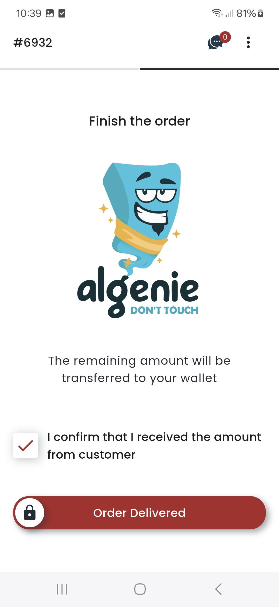 |

| Customer Rating | Report a Problem |
|------|-------------------|
| 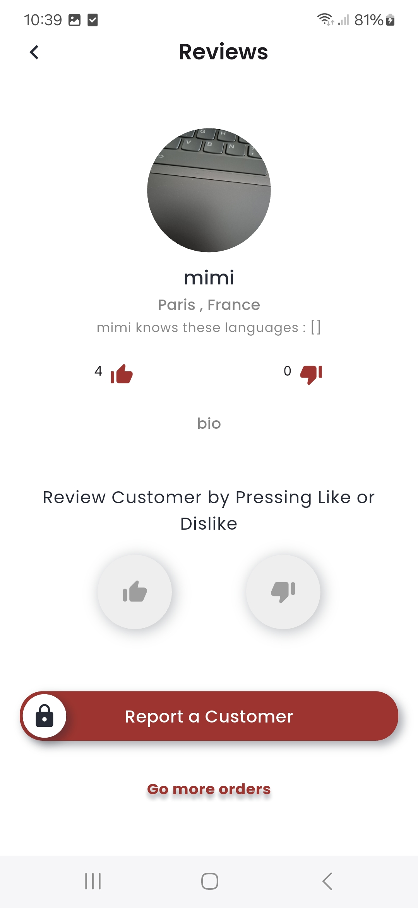 | 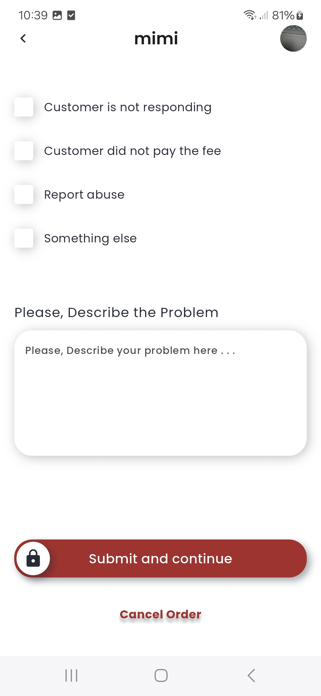 |

### Chat
| Chat |
|------|
|  |

---

## Future Enhancements
- Real-time location tracking
- Google Maps integration
- Performance and scalability optimizations
